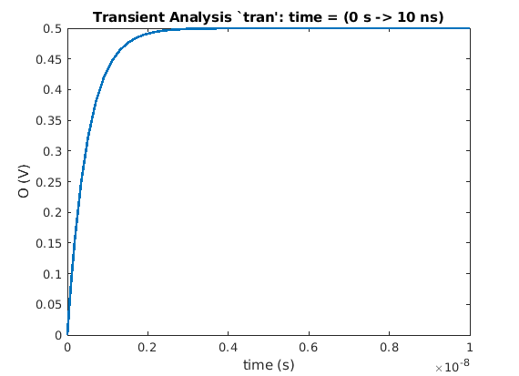

# nutmeg-parser

Reader for the Nutmeg Waveform Format in Java.
Parsers for both ASCII and Binary waveforms are provided.

## Installation

Clone this repository:

```bash
$ git clone https://github.com/electronics-and-drives/nutmeg-reader.git
```

`cd nutmeg-reader` into the directory and install the maven package:

```bash
$ mvn install
```


## Setup

### Java
Add the dependency to your project

```xml
<dependency>
  <groupId>edlab.eda.reader</groupId>
  <artifactId>nutmeg</artifactId>
  <version>0.0.1</version>
</dependency>
```

Import the corresponding package to your code
```java
import edlab.eda.reader.nutmeg.*;
```

### MATLAB
After installation of the Maven repository, the corresponding JAR is typically
created at

```
~/.m2/repository/edlab/eda/reader/nutmeg/0.0.1/nutmeg-0.0.1-jar-with-dependencies.jar
```

Add the JAR to the Java [class path](https://de.mathworks.com/help/matlab/matlab_external/java-class-path.html) 
Furthermore, add
```
<PATH To REPOSITORY>/src/main/matlab
```
to your [search-path](https://de.mathworks.com/help/matlab/search-path.html).


## API

The [JavaDoc](https://electronics-and-drives.github.io/nutmeg-reader/)
is stored on the Github-Pages (branch *gh-pages*).

## Example

### Java

The below shown example shows how a waveform file can be accessed
with *NutReader*.

```java
// Create a new reader
NutReader reader = NutReader
    .getNutasciiReader("./src/test/java/resources/rc/nutascii.raw");

// Read and parse the nutascii
reader.read().parse();

// Get all plots from the reader
List<NutmegPlot> plots = reader.getPlots();

// Get nutmeg plot from list
NutmegPlot nutmegPlot = plots.get(0);

// Get name of plot
nutmegPlot.getPlotname();

// Get number of points from plot
nutmegPlot.getNoOfPoints();

// Get number of variables from plot
nutmegPlot.getNoOfVariables();

// Get set of all waves from plot
Set<String> waves = nutmegPlot.getWaves();

// Check if wave with name "I" is part of plot
nutmegPlot.containsWave("I");

// Get unit of wave with name "I"
nutmegPlot.getUnit("I");

if (nutmegPlot instanceof NutmegRealPlot) {

  // Cast plot to real plot
  NutmegRealPlot nutmegRealPlot = (NutmegRealPlot) nutmegPlot;

  // Get wave of wave with name "I"
  double[] wave = nutmegRealPlot.getWave("I");
}
```

### MATLAB

```matlab

file = './src/test/resources/rc/nutbin.raw'

plots = readNutascii(file);

plot(plots(3).waveData(:,4),plots(3).waveData(:,5),'LineWidth',2);

xlabel(plots(3).waveNames(4) + ' (' + plots(3).waveUnits(4) + ')');
ylabel(plots(3).waveNames(5) + ' (' + plots(3).waveUnits(5) + ')');
title(plots(3).name);

```



## TODO

- [X] Test the reader for waveforms generated with Cadence Spectre
- [ ] Test the reader for waveforms generated with Ngspice
- [ ] Add Octave Interface

## License

Copyright (C) 2021, [Electronics & Drives](https://www.electronics-and-drives.de/)

This program is free software: you can redistribute it and/or modify
it under the terms of the GNU General Public License as published by
the Free Software Foundation, either version 3 of the License, or
(at your option) any later version.

This program is distributed in the hope that it will be useful,
but WITHOUT ANY WARRANTY; without even the implied warranty of
MERCHANTABILITY or FITNESS FOR A PARTICULAR PURPOSE.  See the
GNU General Public License for more details.

You should have received a copy of the GNU General Public License
along with this program. If not, see 
[https://www.gnu.org/licenses/](https://www.gnu.org/licenses).