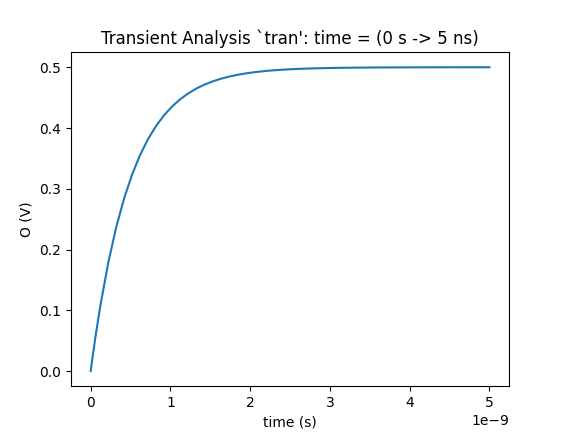

# nutmeg-reader

[](https://github.com/electronics-and-drives/nutmeg-reader/actions/workflows/maven.yml)

Reader for the Nutmeg Waveform Format in Java.
Parsers for both ASCII and Binary waveforms are provided.

## Installation

Clone this repository:

```bash
$ git clone https://github.com/electronics-and-drives/nutmeg-reader.git
```

`cd nutmeg-reader` into the directory.

### Makefile

Simple installation with make:

```bash
$ make java     # for java with maven
$ make python   # for python with pip (will automatically install java)
$ make all      # all of the above
```

### Java Specific

If you're only interested in java you can install it just with maven:

```bash
$ mvn install
```

The repository will be installed to the directory

```bash
$ make mvn-path
```

or

```bash
$ mvn -q -Dexec.executable=echo \
         -Dexec.args='${settings.localRepository}' \
         --non-recursive exec:exec 2>/dev/null
```

You can retrieve the path to the JAR with the makefile

```bash
$ make jar-path
```

or by using the command

```bash
{
  mvn help:evaluate -Dexpression=settings.localRepository | grep -v "^\[" ;
  echo "/" ;
  cat pom.xml | grep -oPm1 "(?<=<groupId>)[^<]+" | sed  's/\./\//g' ;
  echo "/" ;
  cat pom.xml | grep -oPm1 "(?<=<artifactId>)[^<]+" ;
  echo "/" ;
  cat pom.xml | grep -oPm1 "(?<=<version>)[^<]+" ;
  echo "/";
  cat pom.xml | grep --color=never -oPm1 "(?<=<artifactId>)[^<]+";
  echo "-"; 
  cat pom.xml | grep -oPm1 "(?<=<version>)[^<]+";
  echo "-";
  cat pom.xml | grep -oPm1 "(?<=<descriptorRef>)[^<]+";
  echo ".jar"
} | tr -d '\n' 
```

### Python

The python package depends on the java installation. After installing the java
package, you can install the python package with pip:

```bash
$ cd ./src/main/python
$ pip install . --use-feature=in-tree-build
```

## Setup

### Java
Add the dependency to your project

```xml
<dependency>
  <groupId>edlab.eda</groupId>
  <artifactId>reader.nutmeg</artifactId>
  <version>1.0.1</version>
</dependency>
```

Import the corresponding package to your code
```java
import edlab.eda.reader.nutmeg.*;
```

### MATLAB / Octave

There are two variants how the JAR can be loaded in MATLAB / Octave.
The first possibility is to run the command

```matlab
javaaddpath('<PATH_TO_JAR>');
```
The second possibility is to add the path to the JAR to 
the file *javaclasspath.txt* and place this file in the working directory
of MATLAB (this is the directory where MATLAB is started).

Additionally, the corresponding scripts must be added the the search-path of
MATLAB

```matlab
addpath('<PATH_TO_REPOSITORY>/src/main/matlab/');
```

Additional information can be found in the MATLAB and Octave Manuals

- MATLAB
  * [Java Class Path](https://de.mathworks.com/help/matlab/matlab_external/java-class-path.html) 
  * [Search Path](https://de.mathworks.com/help/matlab/search-path.html) 
- Octave
  * [How to make Java classes available to Octave?](https://octave.org/doc/v4.0.1/How-to-make-Java-classes-available_003f.html) 
  * [Manipulating the Load Path](https://octave.org/doc/v4.0.1/Manipulating-the-Load-Path.html) 

### Python

After installing the Java package navigate to the python module
`./src/main/python/` and install it with `pip`.

```
$ pip install . --use-feature=in-tree-build 
```

When creating a `NutmegReader` object a custom `class_path` can be specified,
otherwise the default maven home `$HOME/.m2/repository` or the variable
`MAVEN_HOME` will be used.

```python
nutreader = NutmegReader()
nutreader = NutmegReader(class_path="some/other/path/to/nutmeg.jar")
```

## API

### Java

The [JavaDoc](https://electronics-and-drives.github.io/nutmeg-reader/)
is stored on the Github-Pages (branch *gh-pages*).

### MATLAB / Octave
Execute the commands
```matlab
help readNutascii
```
and
```matlab
help readNutbin
```
to get information how to call the functions in MATLAB / Octave.

### Python

After importing the module, help for the classes can be found via the
docstrings. For example, to get help on `NutmegReader` see:

```python
>>> help(NutmegReader)
```

## Example

### Java

The below shown example shows how a waveform file can be accessed
with *NutReader*.

```java
// Create a new reader
NutReader reader = NutReader
    .getNutasciiReader("./src/test/java/resources/rc/nutascii.raw");

// Read and parse the nutascii
reader.read().parse();

// Get all plots from the reader
List<NutmegPlot> plots = reader.getPlots();

// Get nutmeg plot from list
NutmegPlot nutmegPlot = plots.get(0);

// Get name of plot
nutmegPlot.getPlotname();

// Get number of points from plot
nutmegPlot.getNoOfPoints();

// Get number of variables from plot
nutmegPlot.getNoOfVariables();

// Get set of all waves from plot
Set<String> waves = nutmegPlot.getWaves();

// Check if wave with name "I" is part of plot
nutmegPlot.containsWave("I");

// Get unit of wave with name "I"
nutmegPlot.getUnit("I");

if (nutmegPlot instanceof NutmegRealPlot) {

  // Cast plot to real plot
  NutmegRealPlot nutmegRealPlot = (NutmegRealPlot) nutmegPlot;

  // Get wave of wave with name "I"
  double[] wave = nutmegRealPlot.getWave("I");
}
```

### MATLAB

```matlab

file = './src/test/resources/rc/nutascii.raw'

plots = readNutascii(file);

plot(plots(4).waveData(:,4),plots(4).waveData(:,5),'LineWidth',2);

xlabel(plots(4).waveNames{4} + ' (' + plots(4).waveUnits{4} + ')');
ylabel(plots(4).waveNames{5} + ' (' + plots(4).waveUnits{5} + ')');
title(plots(4).name);
```


### Octave

```matlab
file = './src/test/resources/rc/nutascii.raw'

plots = readNutascii(file);

plot(plots(4).waveData(:,4),plots(4).waveData(:,5),'LineWidth',2);

xlabel([plots(4).waveNames{4} ' (' plots(4).waveUnits{4} ')']);
ylabel([plots(4).waveNames{5} ' (' plots(4).waveUnits{5} ')']);
title(plots(4).name);
```


### Python

```python
from nutmeg_reader import NutmegReader
import pandas as pd
from matplotlib import pyplot as plt

nutreader = NutmegReader()

file = './src/test/resources/rc2/nutascii.raw'
plots = nutreader.read_nutascii(file)

tran_plot = plots[3]
tran_data = pd.DataFrame(tran_plot.wave_data)

fig, axs = plt.subplots(1,1, figsize=(8,8))
axs.plot(tran_data['time'], tran_data['O'])
axs.set_title(tran_plot.name)
axs.set_xlabel(f'time ({tran_plot.wave_units["time"]})')
axs.set_ylabel(f'O ({tran_plot.wave_units["O"]})')
plt.show()
```



## License

Copyright (C) 2021, [Electronics & Drives](https://www.electronics-and-drives.de/)

This program is free software: you can redistribute it and/or modify
it under the terms of the GNU General Public License as published by
the Free Software Foundation, either version 3 of the License, or
(at your option) any later version.

This program is distributed in the hope that it will be useful,
but WITHOUT ANY WARRANTY; without even the implied warranty of
MERCHANTABILITY or FITNESS FOR A PARTICULAR PURPOSE.  See the
GNU General Public License for more details.

You should have received a copy of the GNU General Public License
along with this program. If not, see 
[https://www.gnu.org/licenses/](https://www.gnu.org/licenses).
